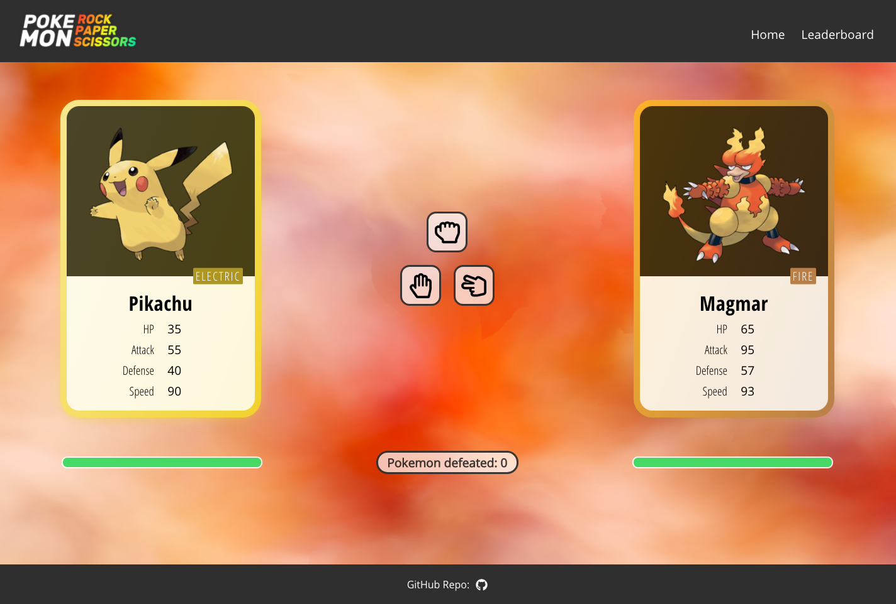

# Pokemon Rock Paper Scissors

A pokemon card game using rock paper scissors for the gameplay

Full-stack web application built with **React.js** and **custom CSS** in the frontend and **Express/Node.js** and **MongoDB** in the backend

Based on a group project with [Abhoy-Tripathy](https://github.com/Abhoy-Tripathy), [aZlateski](https://github.com/aZlateski) and [sly18Peso4all](https://github.com/sly18Peso4all)

**Live demo: https://pokemonrps.netlify.app/**

Code frontend: [github.com/ansocab/pokefight-client](https://github.com/ansocab/pokefight-client)

Code backend: [github.com/ansocab/pokefight-server](https://github.com/ansocab/pokefight-server)

## Libraries and Resources
Frontend:
- create-react-app
- react-router-dom
- react-paginate
- react-spring

- Vanta.js
- FontAwesome

Backend:
- Mongoose

